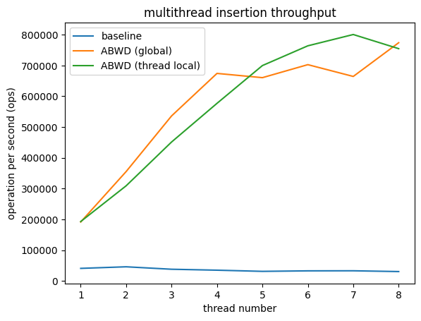
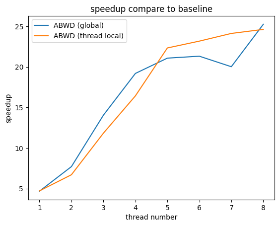

# abwd-benchmark

Asynchronous Batch Write Dispatcher (ABWD) is a asynchronous scheduler that receiveing user request, and batching them together asynchronously. The implementation is [here](https://github.com/taosdata/TDengine/pull/16866).

## Dependencies

```bash
sudo apt install -y build-essential cmake libspdlog-dev libjemalloc-dev
```

## How to use

1. Install the taosc with ABWD feature.

    ```bash
    git clone https://github.com/zhihaop/TDengine/tree/improve/taosc-async-enhancement-for-2.6.git
    cd TDengine
    mkdir build && cd build
    cmake .. -DCMAKE_BUILD_TYPE=Release
    cmake --build . --parallel $(nproc)
    sudo make install
    ```

2. Start TDengine service.

    ```bash
    sudo systemctl start taosd
    ```

3. Build and run abwd-benchmark.

    ```bash
    git clone https://github.com/zhihaop/abwd-benchmark.git
    cd abwd-benchmark
    mkdir build && cd build
    cmake .. -DCMAKE_BUILD_TYPE=Release
    cmake --build . --parallel $(nproc)
    ./abwd-benchmark
    ```

## Benchmark

The super table `meter` has two fields `timestamp` and `voltage` (int).

The table `d0001` is created by the super table `meter`. We write one million SQL statements to the table `d0001` asynchronously, one row per statement.

We set the `max_connections=256`, `batch_size=128`, `timeout=20ms`, and get the following result.

 
